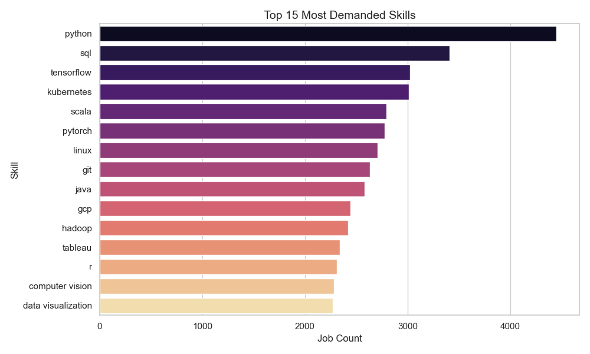
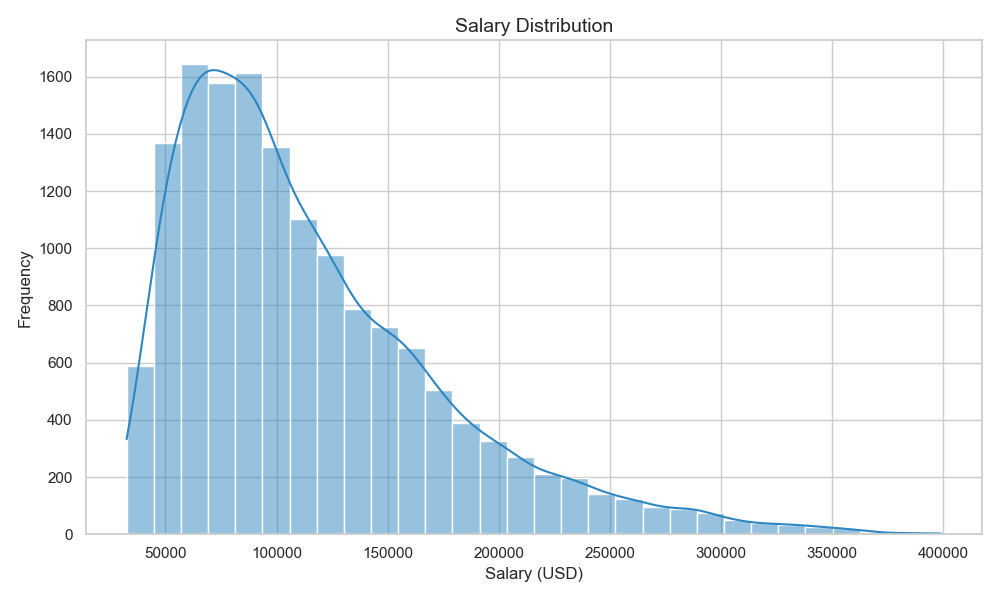
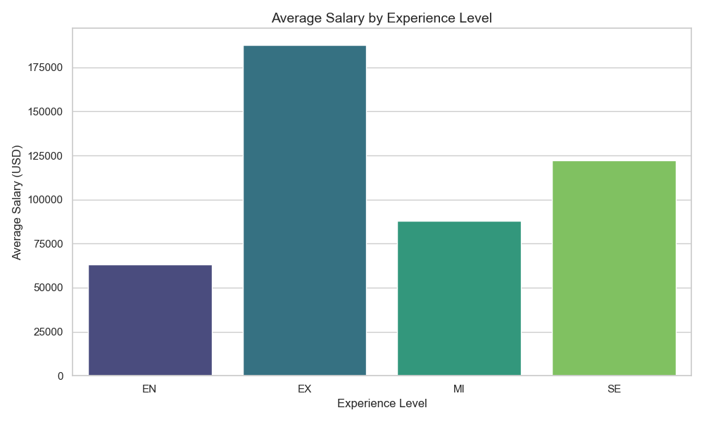
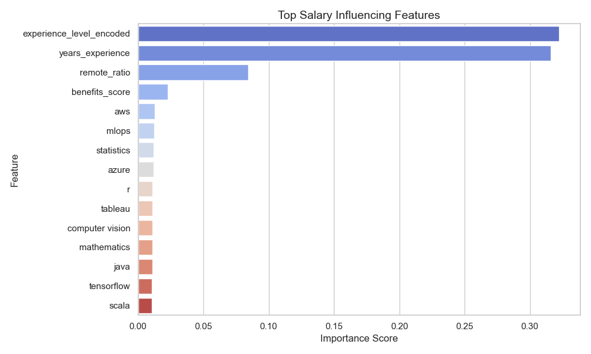
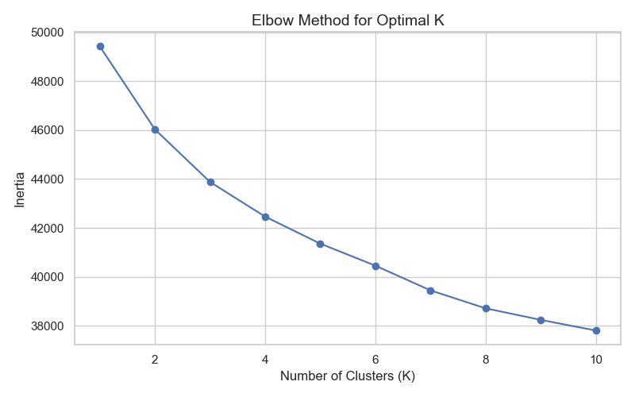

🚀 AI Job Market Analyzer

End-to-end Machine Learning pipeline analyzing 15,000 AI/ML job postings to uncover skill demand trends, role archetypes, and salary drivers.

📊 Results

🔹 Identified Python as the most demanded AI skill

🔹 Discovered 4 AI job archetypes using KMeans clustering

🔹 Salary distribution shows strong right-skew (mid-level concentration + executive tail)

🔹 Random Forest model achieved R² ≈ 0.58

🔹 Experience level and years of experience explain majority of salary variance

📈 Visual Insights
🔹 Top 15 Most Demanded Skills

🔹 Salary Distribution

🔹 Salary by Experience Level

🔹 Feature Importance (Salary Drivers)

🔹 Elbow Method (Cluster Selection)

🧠 Key Findings

Experience drives compensation more than individual tools

Specialization (clusters) has moderate impact on salary

Modern AI roles demand production-ready skills (cloud, DevOps, ML frameworks)

Compensation growth is strongly tied to seniority

⚙️ Tech Stack

Python • Pandas • NumPy • Scikit-learn • Matplotlib • Seaborn • Joblib

🧠 What This Demonstrates

Data cleaning & feature engineering

Multi-label skill encoding

KMeans clustering

Salary regression modeling

Model interpretability

Modular ML pipeline design

▶️ How to Run
git clone https://github.com/IfreenIsrar/ai-job-market-analyzer.git
cd ai-job-market-analyzer
pip install -r requirements.txt
python main.py
📂 Project Structure
ai-job-market-analyzer/
├── data/
├── src/
├── outputs/
├── main.py
├── requirements.txt
└── README.md
